# Diagrama de Clases - Sistema de Biblioteca

## Diagrama UML

```mermaid
classDiagram
    %% Clases del Dominio
    class ItemBiblioteca {
        <<abstract>>
        #string _id
        #string _titulo
        +ItemBiblioteca(string id, string titulo)
        +string Id
        +string Titulo
        +abstract string ObtenerInformacion()
        +string ToString()
    }

    class Libro {
        -string _autor
        -string _isbn
        -bool _disponible
        +Libro(string id, string titulo, string autor, string isbn)
        +string Autor
        +string ISBN
        +bool Disponible
        +bool EstaDisponible()
        +void MarcarComoPrestado()
        +void MarcarComoDisponible()
        +string ObtenerInformacion()
        +string ToString()
    }

    class Usuario {
        -string _id
        -string _nombre
        -List~Prestamo~ _prestamos
        +Usuario(string id, string nombre)
        +string Id
        +string Nombre
        +IReadOnlyList~Prestamo~ Prestamos
        +List~Prestamo~ ObtenerPrestamosActivos()
        +internal void AgregarPrestamo(Prestamo prestamo)
        +string ToString()
        +bool Equals(object obj)
        +int GetHashCode()
    }

    class Transaccion {
        <<abstract>>
        #string _id
        #DateTime _fechaCreacion
        +Transaccion(string id)
        +string Id
        +DateTime FechaCreacion
        +virtual bool EsValida()
        +string ToString()
    }

    class Prestamo {
        -Usuario _usuario
        -Libro _libro
        -DateTime _fechaVencimiento
        -bool _activo
        +Prestamo(string id, Usuario usuario, Libro libro, int diasPrestamo)
        +Usuario Usuario
        +Libro Libro
        +DateTime FechaVencimiento
        +bool Activo
        +bool EstaVencido()
        +int ObtenerDiasRetraso()
        +void RegistrarDevolucion()
        +bool EsValida()
        +string ToString()
    }

    class ResumenBiblioteca {
        +int TotalUsuarios
        +int TotalLibros
        +int LibrosDisponibles
        +int PrestamosActivos
        +int PrestamosVencidos
    }

    %% Interfaces
    class IPrestable {
        <<interface>>
        +bool EstaDisponible()
        +void MarcarComoPrestado()
        +void MarcarComoDisponible()
    }

    class IRepositorioLibro {
        <<interface>>
        +void AgregarLibro(Libro libro)
        +Libro? ObtenerLibro(string id)
        +List~Libro~ ObtenerTodosLibros()
        +List~Libro~ ObtenerLibrosDisponibles()
        +bool ExisteLibro(string id)
        +bool ExisteIsbn(string isbn)
    }

    class IRepositorioUsuario {
        <<interface>>
        +void AgregarUsuario(Usuario usuario)
        +Usuario? ObtenerUsuario(string id)
        +List~Usuario~ ObtenerTodosUsuarios()
        +bool ExisteUsuario(string id)
    }

    class IRepositorioPrestamo {
        <<interface>>
        +void AgregarPrestamo(Prestamo prestamo)
        +Prestamo? ObtenerPrestamo(string id)
        +List~Prestamo~ ObtenerTodosPrestamos()
        +List~Prestamo~ ObtenerPrestamosActivos()
        +List~Prestamo~ ObtenerPrestamosVencidos()
        +List~Prestamo~ ObtenerPrestamosPorUsuario(string usuarioId)
        +void ActualizarPrestamo(Prestamo prestamo)
    }

    %% Servicios
    class ServicioBiblioteca {
        -ServicioUsuario _servicioUsuario
        -ServicioLibro _servicioLibro
        -ServicioPrestamo _servicioPrestamo
        +ServicioBiblioteca(ServicioUsuario, ServicioLibro, ServicioPrestamo)
        +void RegistrarUsuario(string id, string nombre)
        +Usuario? ObtenerUsuario(string id)
        +List~Usuario~ ObtenerTodosUsuarios()
        +void AgregarLibro(string id, string titulo, string autor, string isbn)
        +Libro? ObtenerLibro(string id)
        +List~Libro~ ObtenerTodosLibros()
        +List~Libro~ ObtenerLibrosDisponibles()
        +void RealizarPrestamo(string usuarioId, string libroId, int diasPrestamo)
        +void RegistrarDevolucion(string prestamoId)
        +List~Prestamo~ ObtenerPrestamosActivos()
        +List~Prestamo~ ObtenerPrestamosVencidos()
        +List~Prestamo~ ObtenerTodosPrestamos()
        +ResumenBiblioteca ObtenerResumenGeneral()
    }

    %% Relaciones de Herencia
    ItemBiblioteca <|-- Libro : hereda
    Transaccion <|-- Prestamo : hereda

    %% Relaciones de Implementación
    IPrestable <|.. Libro : implementa

    %% Relaciones de Composición/Agregación
    Prestamo *-- Usuario : contiene
    Prestamo *-- Libro : contiene
    Usuario o-- Prestamo : tiene muchos
    ServicioBiblioteca o-- ServicioUsuario : usa
    ServicioBiblioteca o-- ServicioLibro : usa
    ServicioBiblioteca o-- ServicioPrestamo : usa

    %% Dependencias
    ServicioBiblioteca ..> ResumenBiblioteca : crea
    IRepositorioLibro <|.. RepositorioLibro : implementa
    IRepositorioUsuario <|.. RepositorioUsuario : implementa
    IRepositorioPrestamo <|.. RepositorioPrestamo : implementa
```

## Descripción de la Arquitectura

### Capa de Dominio
- **ItemBiblioteca**: Clase abstracta base para todos los elementos de la biblioteca
- **Libro**: Implementa `ItemBiblioteca` e `IPrestable`, representa un libro específico
- **Usuario**: Representa un usuario del sistema con sus préstamos
- **Transaccion**: Clase abstracta base para operaciones del sistema
- **Prestamo**: Hereda de `Transaccion`, representa un préstamo específico
- **IPrestable**: Interfaz que define el contrato para elementos prestables

### Capa de Infraestructura
- **IRepositorioLibro**: Interfaz para operaciones de persistencia de libros
- **IRepositorioUsuario**: Interfaz para operaciones de persistencia de usuarios
- **IRepositorioPrestamo**: Interfaz para operaciones de persistencia de préstamos
- **RepositorioLibro/Usuario/Prestamo**: Implementaciones concretas (no mostradas en detalle)

### Capa de Servicio
- **ServicioBiblioteca**: Servicio principal que coordina todas las operaciones
- **ServicioUsuario/Libro/Prestamo**: Servicios específicos (no mostrados en detalle)
- **ResumenBiblioteca**: DTO para información resumida del sistema

### Principios de Diseño Aplicados

1. **Herencia**: `Libro` hereda de `ItemBiblioteca`, `Prestamo` hereda de `Transaccion`
2. **Polimorfismo**: `Libro` implementa `IPrestable`, sobrescritura de métodos
3. **Encapsulación**: Propiedades privadas con acceso controlado
4. **Abstracción**: Clases abstractas e interfaces definen contratos
5. **Separación de Responsabilidades**: Capas bien definidas (Dominio, Infraestructura, Servicio)
6. **Inyección de Dependencias**: Servicios reciben dependencias por constructor

### Relaciones Clave

- **Composición**: `Prestamo` contiene `Usuario` y `Libro`
- **Agregación**: `Usuario` tiene una colección de `Prestamo`
- **Herencia**: Jerarquías de clases bien definidas
- **Implementación**: Interfaces implementadas por clases concretas
- **Dependencia**: Servicios dependen de repositorios e interfaces
